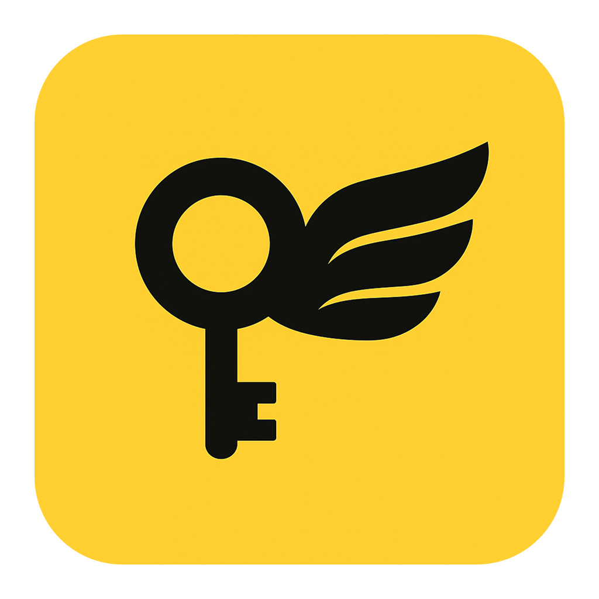

<!-- Add TLDR -->
<div align="center">
  
</div>

<br>

## Open Interview Coder: Your Free AI-Powered Interview Prep Partner

**TL;DR:**
You can try it for **FREE** by downloading the app under [Releases](https://github.com/xhoantran/open-interview-coder/releases) and using your **Google Gemini API key**.

If you don't trust the app (which you should), you're welcome to **clone the repository** and run it yourself!

### Why Open Interview Coder?

I forked this to bring a **fair game** for everyone. Companies need to change how they do technical interviews.

## How to Use

1. **Initial Setup:** Launch the discreet window
2. **Configuration:** Use `Ctrl + Shift + I`/`Cmd + Shift + I` to open the settings menu. Enter your API key and select your preferred AI model for problem extraction and solution generation.
3. **Problem Capture:** Use `Ctrl + H`/`Cmd + H` to take screenshots of coding problems.
4. **AI-Powered Processing:** Press `Ctrl + Enter`/`Cmd + Enter` to send the screenshots for analysis. The AI extracts the problem details, then generates an optimal solution, all using your personal API key.
5. **Solution:** Review the generated solutions with detailed explanations.
6. **Window Management:** Move the window using `Ctrl + Arrow keys`/`Cmd + Arrow keys`, toggle its visibility with `Ctrl + B`/`Cmd + B`, and adjust the opacity with `Ctrl + [`/`Cmd + [` and `Ctrl + ]`/`Cmd + ]`. The window remains hidden from the specified screen sharing applications. Start a new problem session with `Ctrl + R`/`Cmd + R`.

## Core Functionalities

- 🎯 **Stealth Mode:** An almost invisible window that bypasses most screen capture methods.
- 📸 **Smart Capture:** Separate capture of problem text and code for better AI analysis.
- 🤖 **AI Brainpower:** Automatic problem extraction and analysis using GPT-4o.
- 💡 **Solution Insights:** Detailed solutions with time and space complexity analysis.
- 🔧 **Intelligent Debugging:** AI assistance with structured feedback for your code.
- 🎨 **Flexible Window:** Move, resize, adjust opacity, and zoom as needed.
- 🔄 **AI Model Options:** Choose between OpenAI's models or Google Gemini's models for different task.
- 🔒 **Privacy First:** Your API key and data stay local, except for direct calls to OpenAI or Google Gemini.

## Global Shortcuts

These unobtrusive keyboard commands won't clash with other applications:

- Start New Problem: `Ctrl + R` or `Cmd + R`
- Open Settings: `Ctrl + Shift + I` or `Cmd + Shift + I`
- Take Screenshot: `Ctrl + H` or `Cmd + H`
- Process Screenshots: `Ctrl + Enter` or `Cmd + Enter`
- Toggle Visibility: `Ctrl + B` or `Cmd + B`
- Move Window: `Ctrl + Arrow keys` or `Cmd + Arrow keys`
- Decrease Opacity: `Ctrl + [` or `Cmd + [`
- Increase Opacity: `Ctrl + ]` or `Cmd + ]`
- Quit: `Ctrl + Q` or `Cmd + Q`

## Invisibility Details

**Hidden From:**

- Zoom versions older than 6.1.6.
- All browser-based screen recording software.
- All versions of Discord.
- macOS screenshot (Command + Shift + 3/4).

**Visible To:**

- Zoom versions 6.1.6 and above (downgrade if necessary: https://zoom.en.uptodown.com/mac/versions).
- macOS screen recording (Command + Shift + 5).

## Getting Started: Installation and Development Setup

### Prerequisites

Before you begin, ensure you have:

- Node.js (v16 or higher) installed on your system.
- npm package manager.
- An active OpenAI API Key or Google Gemini API Key.
- Screen Recording Permission enabled for your Terminal/IDE:
  - **macOS:** Go to System Preferences > Security & Privacy > Privacy > Screen Recording, find Open Interview Coder, and ensure it's checked. Restart the app after enabling.
  - **Windows:** No additional permissions are required.
  - **Linux:** Depending on your distribution, you might need to grant `xhost` access.

### Installation Steps

1. Clone the repository:
   ```bash
   git clone https://github.com/xhoantran/open-interview-coder.git
   cd open-interview-coder
   ```
2. Install the necessary dependencies:
   ```bash
   npm install
   ```

### Running in Development Mode

To start the application in a development environment:

```bash
npm run start
```

### Building for Production

To create distributable packages for your local platform:

```bash
npm run package
```

This command will package the application for your current operating system.

### Building Distributable Packages for Specific Platforms

To create installable packages for macOS (DMG) or Windows (Installer):

**For macOS (DMG):**

```bash
npm run package-mac
# Or using yarn
yarn package-mac
```

**For Windows (Installer):**

```bash
npm run package-win
# Or using yarn
yarn package-win
```

The resulting packaged applications will be located in the `release` directory.

### Important Considerations and Troubleshooting

- **Window Manager Conflicts:** Some window management utilities (like Rectangle Pro on macOS) might interfere with the app's window positioning. Consider temporarily disabling them if you encounter issues.
- **OpenAI API Usage:** Be mindful of your OpenAI API key's rate limits and the costs associated with different API calls, especially Vision API calls which are more expensive.
- **Custom LLM Integration:** You can explore integrating other Large Language Models (LLMs) such as Claude, Deepseek, or Grok by modifying the API calls within `/src/main/processor`.
- **Common Issues and Solutions:**
  - If the application window doesn't appear, try toggling its visibility multiple times using `Ctrl+B`/`Cmd+B`.
  - Adjust the window's opacity using `Ctrl+[`/`Cmd+[` and `Ctrl+]`/`Cmd+]` if it seems invisible.

## Comparison with Paid Alternatives

| Feature                        | Premium Tools (Paid) | Open Interview Coder (This Project) |
| ------------------------------ | -------------------- | ----------------------------------- |
| Price                          | $60+/month           | Free (pay only for your API usage)  |
| Solution Generation            | ✅                   | ✅                                  |
| Debugging Assistance           | ✅                   | ✅                                  |
| Invisibility                   | ✅                   | ✅                                  |
| Multi-language Support         | ✅                   | ✅ (extensible)                     |
| Time/Space Complexity Analysis | ✅                   | ✅                                  |
| Window Management              | ✅                   | ✅                                  |
| Auth System                    | Required             | None (simplified)                   |
| Payment Processing             | Required             | None (use your own API key)         |
| Privacy                        | Server-processed     | 100% Local Processing               |
| Customization                  | Limited              | Full Source Code Access             |
| Model Selection                | Limited              | Choice Between Models               |

## Tech Stack Highlights

- Electron
- React
- TypeScript
- Tailwind CSS
- Radix UI Components
- OpenAI API
- Google Gemini API

## Extending AI Model Support

Open Interview Coder is built with extensibility in mind. You can easily add support for more LLMs beyond the default OpenAI and Google Gemini integration:

- Integrate models like Claude, Deepseek, Grok, or any other AI with an accessible API.
- The application's architecture is designed to accommodate multiple LLM backends simultaneously.
- Users gain the flexibility to choose their preferred AI provider for different tasks.

## License

This project is licensed under the GNU Affero General Public License v3.0 (AGPL-3.0).

### What This Means for You

- You have the freedom to use, modify, and distribute this software.
- If you make any modifications to the code, you are required to make your changes available under the same license.
- If you run a modified version of this software on a network server, you must make the source code available to its users.
- We strongly encourage you to contribute any improvements you make back to the main project for the benefit of the community.

For a summary of the license terms, see the [LICENSE-SHORT](LICENSE-SHORT) file, or visit [GNU AGPL-3.0](https://www.gnu.org/licenses/agpl-3.0.html) for the complete license text.

### Contributing

We warmly welcome contributions from the community! Please refer to our [Contributing Guidelines](CONTRIBUTING.md) for detailed information on how you can get involved.

## Disclaimer and Ethical Use

Use at your own risk. I **do not** use this in actual interviews and **do not recommend** doing so.

## Support and Questions

If you have any questions, require support, or encounter issues, please do not hesitate to open a new issue on the GitHub repository.
